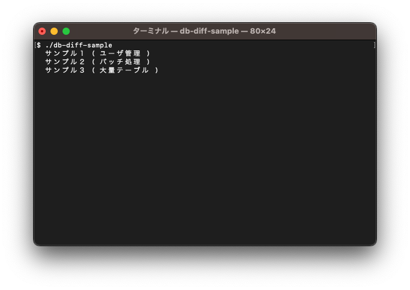

# DB Diff Sample

https://github.com/suzuki-hoge/db-diff のためのサンプルプロジェクトです

コマンドラインで起動すると、対話形式で擬似的なアプリケーションを実行できます



３サンプルが含まれています  
操作やデータに特に意味はありません

テーブルには主キー以外の制約はありませんし、データの更新にも整合性はありません

データの挿入はランダムな内容で行われ、データの更新も適当な対象を適当に更新します

## サンプル１ ( ユーザ管理 )


オンラインでユーザが行うような操作１つ１つを擬似的に発生させます

## サンプル２ ( バッチ処理 )


在庫管理や発送業務のような一括処理を擬似的に発生させます

## サンプル３ ( 大量テーブル )


100 テーブルを適当に生成します

## 実行方法

### データベース ( MySQL ) の準備

次の接続情報で接続できる MySQL ( ver 8.0 ) データベースを３つ用意してください

| username | password | host      | port  | database name |
|----------|----------|-----------|-------|---------------|
| user     | password | localhost | 13306 | sample1       |
| user     | password | localhost | 23306 | sample2       |
| user     | password | localhost | 33306 | sample3       |

テーブルの作成は必要ありません

本リポジトリを clone すると、３データベースをまとめて Docker Compose で起動することができます

```
$ cd db-diff-sample
$ docker compose up --detach
```

コンテナを修了する場合は次のコマンドを実行してください

```
$ docker compose down
```

### コマンドの準備

[Releases](https://github.com/suzuki-hoge/db-diff-sample/releases) ページの [db-diff-sample](https://github.com/suzuki-hoge/db-diff-sample/releases/download/v1.2.0/db-diff-sample) をダウンロードして、コマンドラインで実行してください

```
$ cd path/to/download
$ ./db-diff-sample
```

Rust が実行できる場合は本リポジトリを clone して実行しても構いません

```
$ cd db-diff-sample
$ cargo run
```
